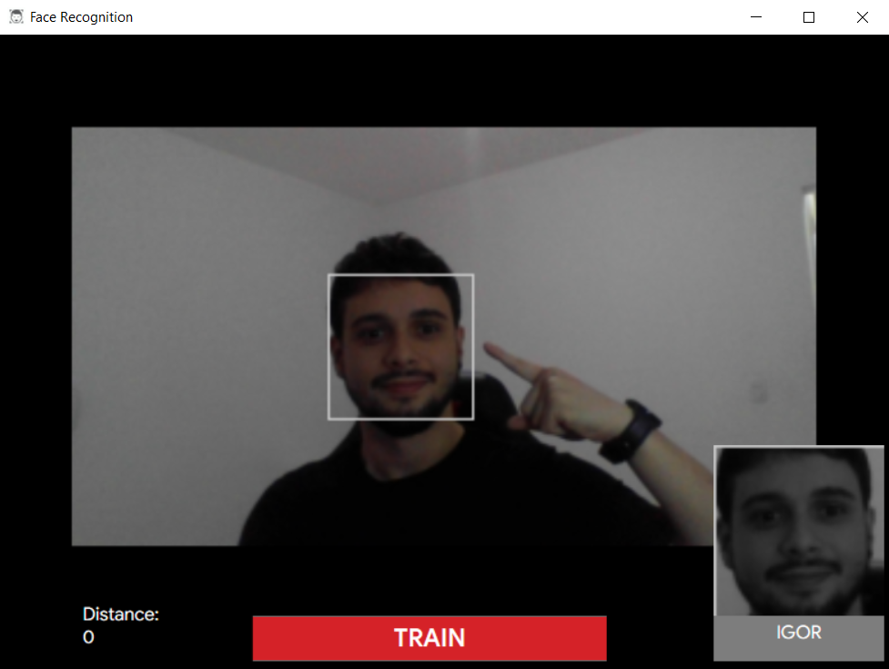

# Face Detection and Recognition Application

This project is a casual, learning-oriented application developed in C# utilizing the .NET Framework 4.7.2 and EMGU.CV 4.1.0.3420. It aims to explore the basics of facial detection and recognition technologies.

This project utilizes EMGU.CV, a cross-platform .Net wrapper for the OpenCV image-processing library.

## Preview

## Contributing
Contributions to this project are welcome! 
Please fork the repository and submit a pull request with your proposed changes.

## Author

* **Igor Couto** - [igor.fcouto@gmail.com](mailto:igor.fcouto@gmail.com)
